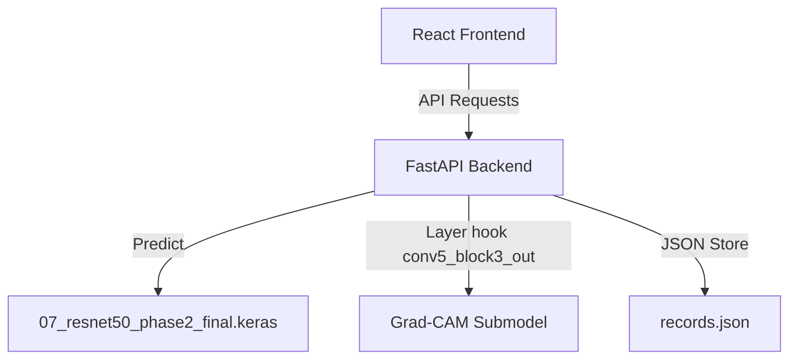

# NeuroVision AI: Brain Tumor MRI Classifier

An academic decision-support prototype serving predictions and explainability maps for a four-class Brain Tumor MRI classification model.

> [!WARNING]
> **ACADEMIC RESEARCH PROTOTYPE ONLY**
> This application is not clinically validated, is not a medical device, and must not be used for diagnosis or treatment decisions. It is designed solely as an educational demonstration. Predictions must not be treated as medical diagnoses.

---

## Key Features
- **Inference Server**: FastAPI backend delivering predictions from a fine-tuned ResNet50 model.
- **Explainability Studio**: Visual model attention maps generated in real-time using Grad-CAM.
- **Performance Laboratory**: Honest per-class reporting and confusion matrices.
- **Interactive UI**: Sleek React + Vite interface with live/mock modes and history tracking.

---

## System Architecture



---

## Model Information
- **Final Model File:** `07_resnet50_phase2_final.keras`
- **Model backbone / Architecture:** Fine-tuned ResNet50 (functional backbone with fine-tuned last 50 layers)
- **Input Dimensions:** `224 x 224 x 3` (RGB)
- **Class order:** `["glioma", "meningioma", "notumor", "pituitary"]`
- **Verified Official Test Accuracy:** 94.80% (on 1,595 test images)

### Verified Per-Class Classification Metrics (Official Test Set)
- **Glioma:** Precision 98.78% | Recall 82.28% | F1-Score 89.78%
- **Meningioma:** Precision 89.79% | Recall 96.75% | F1-Score 93.14%
- **No Tumor:** Precision 93.90% | Recall 100.00% | F1-Score 96.85%
- **Pituitary:** Precision 97.80% | Recall 100.00% | F1-Score 98.89%

---

## Preprocessing Pipeline
- All input images are resized to `(224, 224)` using Bilinear interpolation.
- Channel reordering (RGB to BGR) and ImageNet channel subtraction are handled **inside the functional saved model graph**.
- Therefore, API requests send raw RGB float32 `[0, 255]` pixel arrays.

---

### Evaluation Dataset

The final NeuroVi Vision model was evaluated on an exact 1,595-image subset derived from the Brain Tumor MRI Dataset by Masoud Nickparvar.

- **Evaluation subset:** 1,595 MRI images
- **Glioma:** 395 images
- **Meningioma:** 400 images
- **No Tumor:** 400 images
- **Pituitary:** 400 images
- **Reported accuracy on this subset:** 94.80%
- **License:** CC BY 4.0

The exact evaluation subset used for reproducibility is publicly available on Kaggle:

- **NeuroVi Vision MRI Evaluation Test Subset:** https://www.kaggle.com/datasets/adk119/neurovi-vision-evaluated-test-subset
- **Original dataset source:** https://www.kaggle.com/datasets/masoudnickparvar/brain-tumor-mri-dataset

Compared with the 1,600-image Testing split obtained from the original dataset, the local evaluation subset used by NeuroVi Vision does not contain five glioma files:

`Te-gl_1.jpg`, `Te-gl_10.jpg`, `Te-gl_100.jpg`, `Te-gl_101.jpg`, and `Te-gl_102.jpg`.

The reason these files were absent from the local evaluation copy is unknown. No claim is made that their absence was intentional.

---

## Repository vs Release Assets
Due to the large size of trained deep learning models, Keras model files (`*.keras`) are intentionally excluded from Git tracking. They are instead hosted as release assets on GitHub:

- **GitHub Repository contains:**
  - Full application source code
  - React + TypeScript + Vite frontend (`frontend/`)
  - FastAPI backend (`backend/`)
  - Python ML training scripts
  - Evaluation (`full_evaluation.py`) and test suites (`backend/tests/`)
  - Project documentation (`docs/`) and experiment summaries

- **GitHub Releases contain:**
  - Final deployable model artifact weights
  - Six historical/experimental trained model artifacts

---

## Trained Model Downloads

Please download the required trained model files from the published GitHub Releases:

### A. Final Runtime Model
Users who only want to run or test the NeuroVi Vision application need the final, verified trained model:
- **Model Name:** `07_resnet50_phase2_final.keras`
- **Download Link:** [NeuroVi Vision Stable Runtime v1.0.0 Release](https://github.com/Dinesh-AD119/neurovi-vision/releases/tag/v1.0.0)
- **Required Destination:** Place the file at `models/final/07_resnet50_phase2_final.keras`

### B. Experimental Model Artifacts
Research inspectors interested in model comparisons, training checkpoints, or reproducibility can download all six trained experimental models:
- **Model Names:**
  - `01_cnn_baseline.keras`
  - `02_cnn_v4.keras`
  - `03_cnn_v5.keras`
  - `04_resnet50_phase1.keras`
  - `05_resnet50_v6.keras`
  - `06_xception_v7.keras`
- **Download Link:** [NeuroVi Vision Experimental Artifacts experiments-v1.0 Release](https://github.com/Dinesh-AD119/neurovi-vision/releases/tag/experiments-v1.0)
- **Required Destination:** Place the files inside `models/experiments/`

---

## Model Artifact Integrity
To verify that your downloaded model artifacts were not corrupted during download, you can calculate their SHA-256 hashes:

- **Windows PowerShell:**
  ```powershell
  Get-FileHash -Algorithm SHA256 models/final/07_resnet50_phase2_final.keras
  ```

- **Linux / macOS:**
  ```bash
  sha256sum models/final/07_resnet50_phase2_final.keras
  ```

---

## Quick Start from Fresh Clone

Follow these steps to run a fresh clone of the application end-to-end:

### 1. Clone & Set Up Python Environment
```bash
# 1. Clone the repository
git clone https://github.com/Dinesh-AD119/neurovi-vision.git
cd neurovi-vision

# 2. Set up Python virtual environment
python -m venv venv
venv\Scripts\activate

# 3. Install Python backend dependencies
pip install -r requirements.txt
```

### 2. Download and Place Model Artifact
1. Go to the [v1.0.0 Release](https://github.com/Dinesh-AD119/neurovi-vision/releases/tag/v1.0.0) page.
2. Download `07_resnet50_phase2_final.keras`.
3. Create the destination directory `models/final/` if it does not exist, and place the file there:
   `models/final/07_resnet50_phase2_final.keras`

### 3. Verify and Start Backend
```bash
# Run backend test suite
pytest backend/tests -v

# Optional: reproduce the reported evaluation result.
# First download the published evaluation subset from Kaggle
# and place the Testing directory at dataset/Testing.
python full_evaluation.py

# Start the FastAPI backend server
uvicorn backend.main:app --reload
```

### 4. Install & Start Frontend
Open a new terminal tab or window:
```bash
cd frontend

# Clean-install dependencies matching the package lockfile
npm ci

# Start Vite frontend development server
npm run dev
```

---

## License & Usage Disclaimer

Please refer to [`docs/MODEL_CARD.md`](docs/MODEL_CARD.md), [`docs/ARCHITECTURE.md`](docs/ARCHITECTURE.md), and [`docs/EVALUATION.md`](docs/EVALUATION.md) for model details, system architecture, evaluation methodology, limitations, and ethical considerations.
