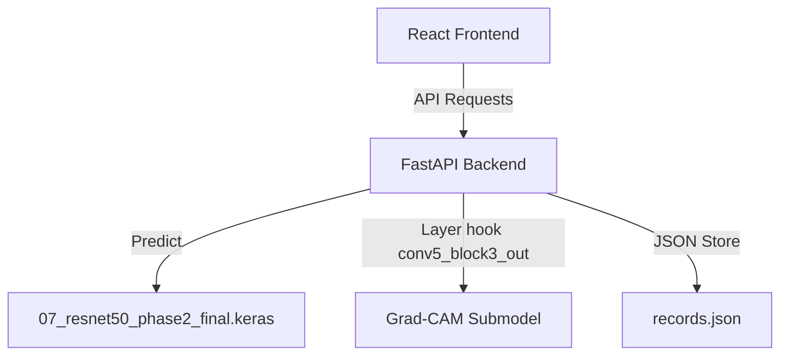

# NeuroVision AI: Brain Tumor MRI Classifier

An academic decision-support prototype serving predictions and explainability maps for a four-class Brain Tumor MRI classification model.

> [!WARNING]
> **ACADEMIC RESEARCH PROTOTYPE ONLY**
> This application is not clinically validated, is not a medical device, and must not be used for diagnosis or treatment decisions. It is designed solely as an educational demonstration.

---

## Key Features
- **Inference Server**: FastAPI backend delivering predictions from a fine-tuned ResNet50 model.
- **Explainability Studio**: Visual model attention maps generated in real-time using Grad-CAM.
- **Performance Laboratory**: Honest per-class reporting and confusion matrices.
- **Interactive UI**: Sleek React + Vite interface with live/mock modes and history tracking.

---

## System Architecture



---

## Model Information
- **Model backbone:** ResNet50 (functional backbone with fine-tuned last 50 layers)
- **Verified Official Test Accuracy:** 94.80% (on 1,595 test images)
- **Target classes:** `glioma`, `meningioma`, `notumor`, `pituitary`

### Verified Per-Class Classification Metrics (Official Test Set)
- **Glioma:** Precision 98.78% | Recall 82.28% | F1-Score 89.78%
- **Meningioma:** Precision 89.79% | Recall 96.75% | F1-Score 93.14%
- **No Tumor:** Precision 93.90% | Recall 100.00% | F1-Score 96.85%
- **Pituitary:** Precision 97.80% | Recall 100.00% | F1-Score 98.89%

---

## Preprocessing Pipeline
- All input images are resized to `(224, 224)` using Bilinear interpolation.
- Channel reordering (RGB to BGR) and ImageNet channel subtraction are handled **inside the functional saved model graph**.
- Therefore, API requests send raw RGB float32 `[0, 255]` pixel arrays.

---

## Setup & Run Instructions

### 1. Backend Setup
Make sure you place the verified model weights at:
`models/final/07_resnet50_phase2_final.keras`

```bash
# Set up Python virtual environment
python -m venv venv
venv\Scripts\activate

# Install dependencies
pip install -r requirements.txt

# Start FastAPI development server
uvicorn backend.main:app --reload
```

### 2. Frontend Setup
```bash
cd frontend
npm ci
npm run dev
```

### 3. Running Evaluations
```bash
python full_evaluation.py
```

### 4. Running Tests
```bash
pytest backend/tests -v
```

---

## License & Usage Disclaimer
Please refer to [docs/MODEL_CARD.md](file:///D:/Brain_Tumor_Classifier/docs/MODEL_CARD.md) and [docs/ARCHITECTURE.md](file:///D:/Brain_Tumor_Classifier/docs/ARCHITECTURE.md) for full system specifications and ethical considerations.
