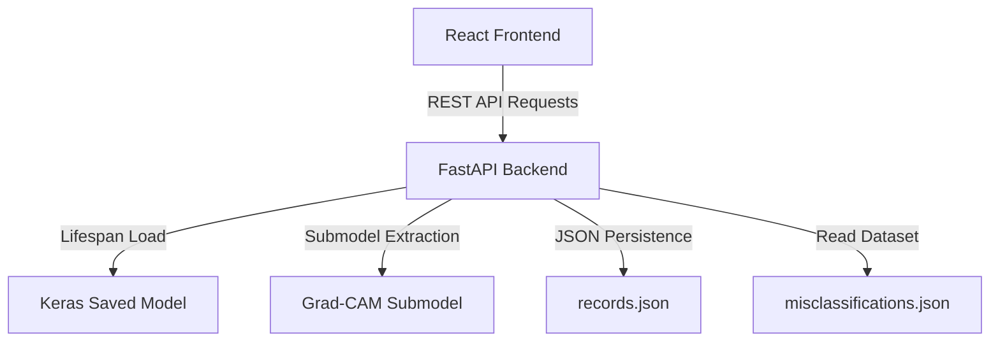

# System Architecture: NeuroVision AI

This document provides a technical overview of the architecture of the NeuroVision AI application.

## 1. High-Level System Architecture

The application is structured as a client-server web app:
- **Frontend:** Built with React, TypeScript, and Vite. Routes are managed via TanStack Router.
- **Backend:** Powered by FastAPI (Python), serving endpoints for health checks, model prediction, Grad-CAM visualization, and historical case logging.
- **Model Storage:** Frozen weights are loaded directly by the backend from `models/final/07_resnet50_phase2_final.keras`.

---

## 2. Preprocessing & Model Pipeline

### Embedded Preprocessing
During model definition, a series of Keras functional layers were built directly into the graph:
1. **`InputLayer`**: Expects raw image inputs of shape `(224, 224, 3)`.
2. **`Sequential`**: Applies data augmentation (`RandomFlip`, `RandomRotation`, `RandomZoom`) which is bypassed during inference.
3. **Embedded Channel Operations**: Slices the input tensor channels, reorders them to `[BGR]` format, and zero-centers each channel by subtracting the ImageNet mean `[103.939, 116.779, 123.680]`.
4. **`resnet50`**: The core ResNet50 convolutional backbone receives the preprocessed tensors.

Therefore, the API client simply sends raw RGB float32 `[0, 255]` pixel arrays. No external normalization or preprocessing is required for predictions.

---

## 3. Grad-CAM Visualization extraction

Because the preprocessing operations are defined in the outer layers of the main model, constructing the Grad-CAM sub-model requires direct extraction of the nested `resnet50` backbone:
1. The backend retrieves the internal layer named `"resnet50"`.
2. It constructs a sub-model mapping the inputs of `"resnet50"` to:
   - The output of the target convolutional layer (`"conv5_block3_out"`).
   - The final prediction tensor.
3. Because the inputs to `"resnet50"` bypass the outer model's channel reordering and subtraction layers, the backend manually applies `preprocess_input` to the image array *before* running it through the Grad-CAM sub-model.
